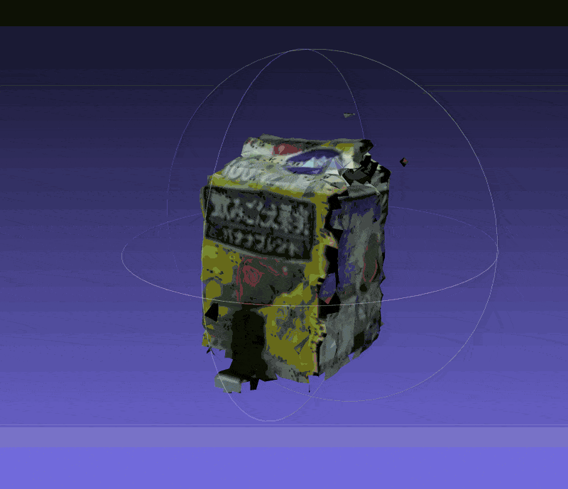

# Texture Mapping

## Install

```
pip install texture-mapping
```

## Input txt config format

`txt` file indicates camera pose and intrinsic parameters.
The format is as follows.

```
translation_x translation_y translation_z
rotation_00 rotation_01 rotation_02
rotation_10 rotation_11 rotation_12
rotation_20 rotation_21 rotation_22
fx
fy
cx
cy
image_height
image_width
```

## Examples

```
git clone https://github.com/iory/texture-mapping.git
cd texture-mapping
texture-mapping --input examples/obj.ply --out textured.obj --config-dir examples/
```

Output obj file `textured.obj` will be created at the same directory of input ply file.


